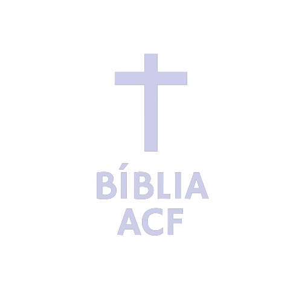
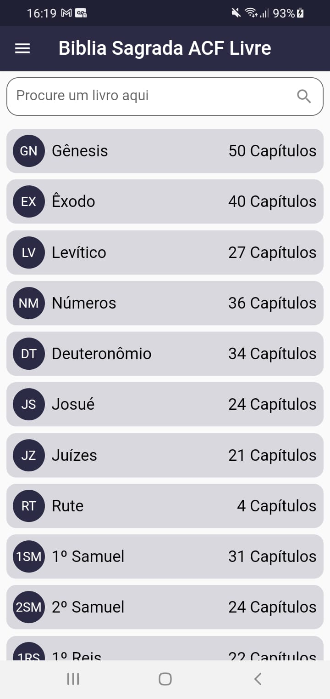
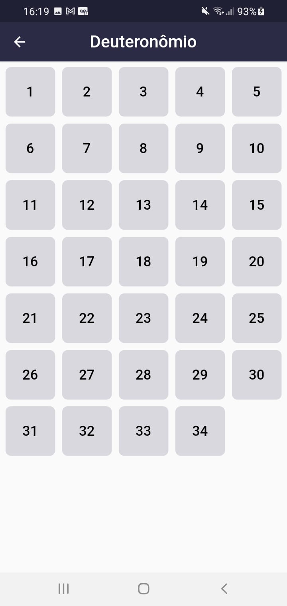

<h1 align="center">
  
  
Bíblia Sagrada ACF Livre

  

    
    
    
  

</h1>

<blockquote>
  

    "Pois a palavra de Deus é viva e eficaz, e mais afiada que qualquer espada de dois gumes; ela penetra até o ponto de dividir alma e espírito, juntas e medulas, e julga os pensamentos e as intenções do coração."
     
    <strong>Hebreus 4:12</strong>
  

</blockquote>

Projeto Open Source da Bíblia. Tornando a Bíblia cada dia mais acessível a todos os brasileiros.

  
  
  

 Em breve disponível na Google Play!!

